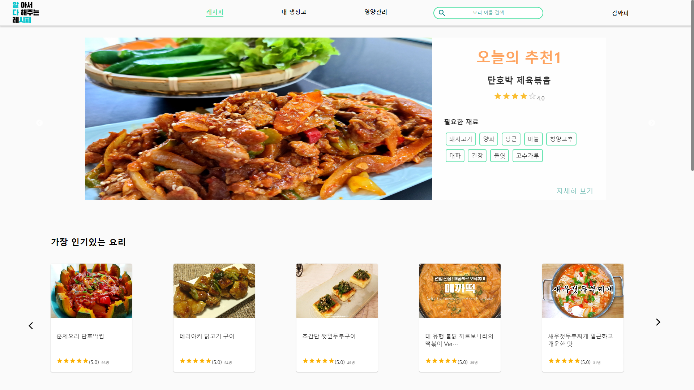
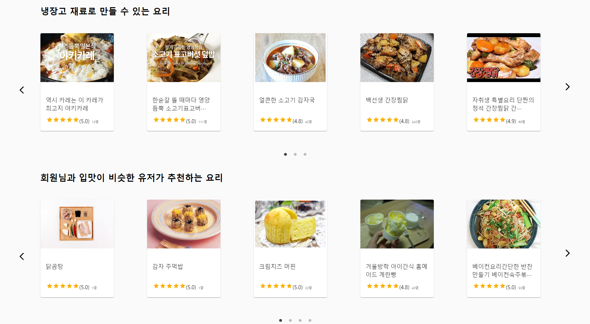
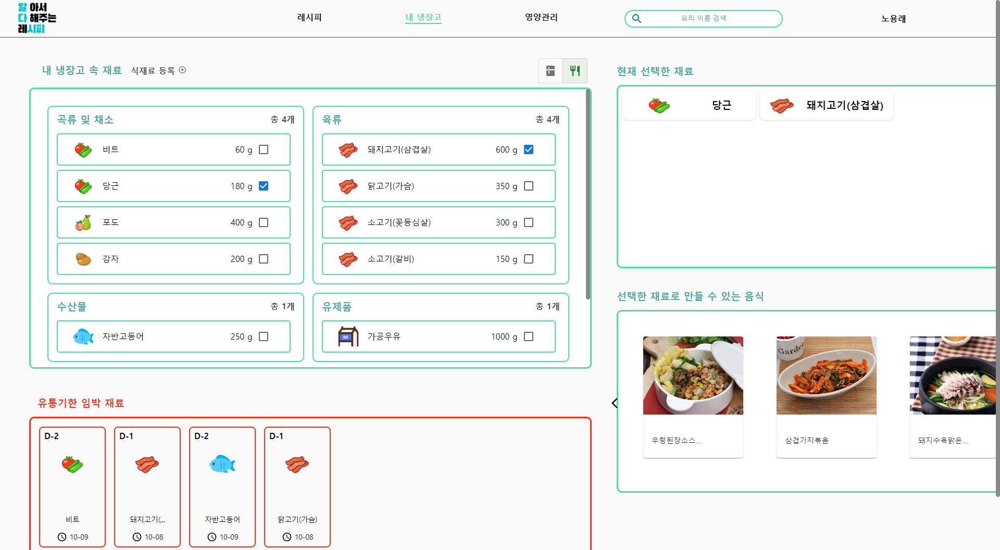
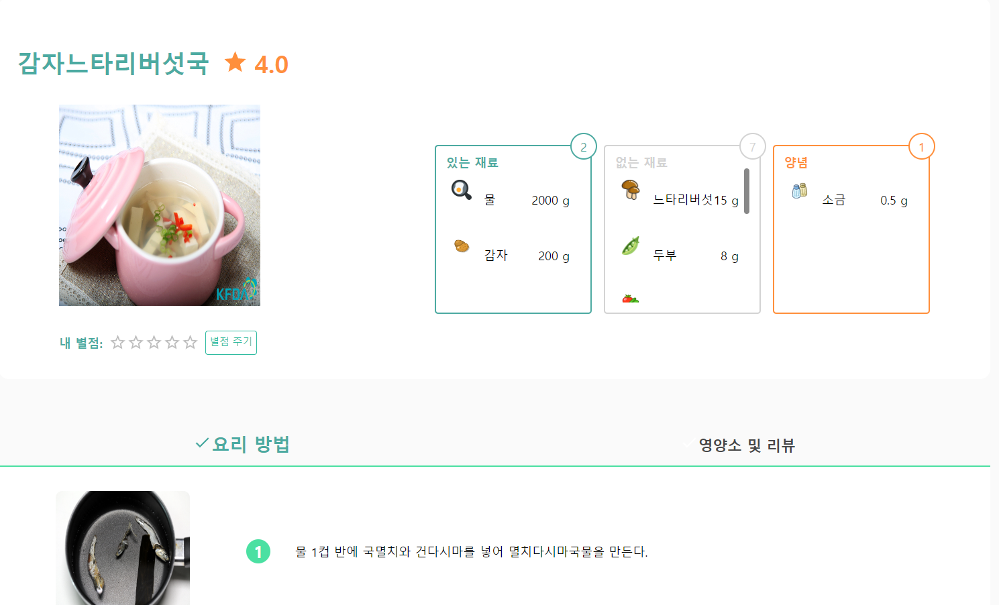
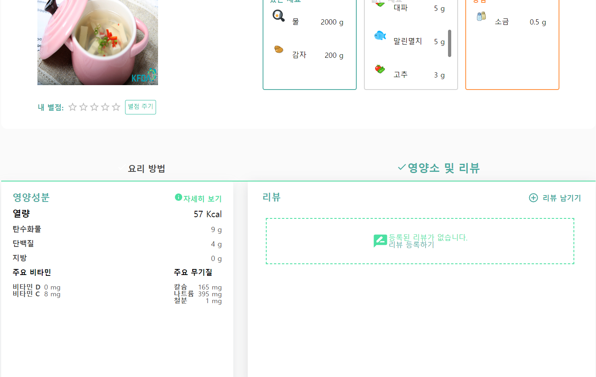
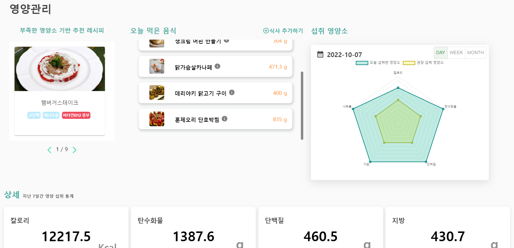
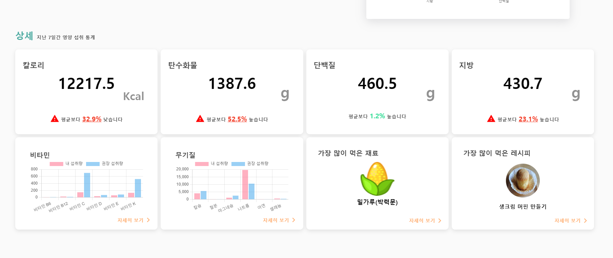
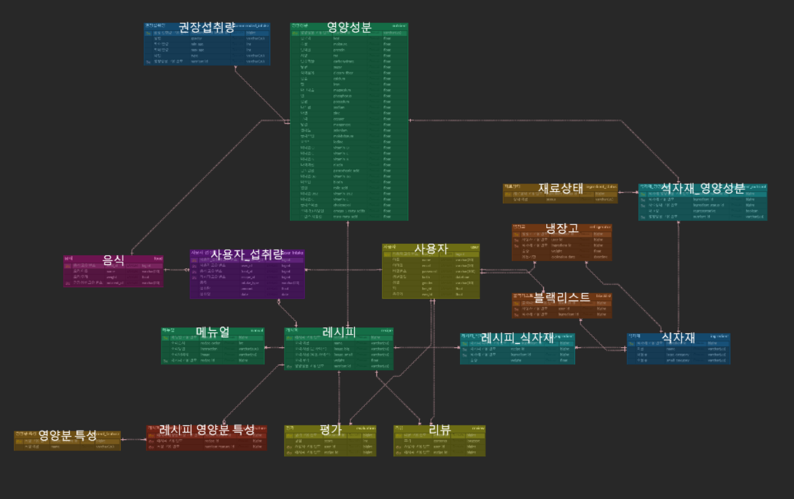

# ReadMe

# 알다시피

## 냉장고 관리, 레시피 추천, 영양관리 통합 서비스

## 배포

[https://j7a501.p.ssafy.io/](https://j7a501.p.ssafy.io/)

## 👨‍👩‍👧 Notion

---

`A501 팀 노션 링크`

[https://www.notion.so/A501-257f80ad60c14c8bba20607907b2e13d](https://www.notion.so/A501-257f80ad60c14c8bba20607907b2e13d)

모두가 봐야할 공지, 참고 할 링크 등을 모아 관리했습니다. 그리고 항상 모든 회의 및 피드백은 기록으로 남겨두어서 잘 반영할 수 있도록 하였습니다. 컨벤션 규칙, 요구사항 정의서, API 문서 등도 노션에 기록하여 모두가 항시 확인할 수 있도록 관리했습니다.

## ✨Overview

공공기관의 조사 결과에 따르면, 최근 5년간 한국인의 영양 결핍, 그리고 칼로리 과잉으로 인한 비만 환자 수가 증가하는 것으로 나타났습니다. 전문가들은 이에 대해서 현대인의 불균형한 식습관이 원인이라고 지목하였습니다.

현재 우리나라의 열 가구 중 네 가구가 1인 가구이며, 1인 가구를 대상으로 한 설문 조사 결과 "균형잡힌 식사가 어렵다" 가 불편한 점 1위를 차지한 것을 조사 결과 알 수 있었습니다.

개인의 경험과 관련 신문기사, 분석 자료를 바탕으로 이를 바탕으로 나의 식재료와 섭취한 영양소를 동시에 고려할 수가 있다면, 좀 더 나은 식사가 가능하지 않을까? 라는 생각을 하게 되었고 알다시피 서비스를 기획하였습니다.

## 🖼서비스 화면

### 메인 화면

### 냉장고 페이지

### 검색 페이지

### 상세 페이지

### 영양관리 페이지

## ✨ 주요 기능

---

- 서비스 설명 : 냉장고 관리, 레시피 추천, 영양관리 통합 서비스
- 주요 기능 :
    - 냉장고 관리
    - 섭취 데이터를 바탕으로 한 영양관리
    - 냉장고 재료, 평점, 영양섭취정보 기반 레시피 추천
    

## 🖥️ 개발 환경

---

🖱**Backend**

- IntelliJ
- spring boot 2.4.5
- spring-boot-jpa
- Spring Security
- Java 8
- AWS EC2
- mysql
- redis
- django

🖱**Frontend**

- Visual Studio Code
- React.js 18.0.2
- SCSS
- Material-UI
- redux-toolkit 1.8.3
- redux 4.1.0
- typescript

🖱**CI/CD**

- aws ec2
- docker
- nginx
- jenkins

## 💫 서비스 아키텍처

---

## 💭요구사항 정의서

[https://docs.google.com/spreadsheets/d/1pVSvKa985xIfyVSIh7tBxV8JFQ2C8oz1SfbBd9jUJw4/edit#gid=0](https://docs.google.com/spreadsheets/d/1pVSvKa985xIfyVSIh7tBxV8JFQ2C8oz1SfbBd9jUJw4/edit#gid=0)

## ✨자동 배포와 배포 특이점

---

저희는 자동 배포를 위해서 다음과 같이 구성하였습니다. 

 

- Frontend와 Backend개발을 독립적으로 할 수 있게 구성하였습니다.

Jenkins에 front, back 2가지 item을 생성하여 하나의 gitlab안에 두 가지 WebHook을 통해서 frontend와 backend를 독립시켰습니다. 이에 따라 backend branch에 push나 merge시 jar파일만 배포 서버로 전송하였고 frontend branch에 push나 merge시 build폴더만 배포 서버로 전송하였습니다. 이로 인해 개발의 효율성이 증가하였습니다.

- Jenkins를 docker container로 분리시켰습니다.

Jenkins와 배포 서버를 분리함으로써 Jenkins 사용성을 증가시켰습니다. Jenkins 내에서 서버와 상관없이 빌드를 완료하고 publish over ssh 플러그인을 통해서 빌드 결과를 배포 서버로 전송하였습니다. 

## ✨기술 특이점

---

- **데이터 전처리**

 수집한 데이터에서 레시피 데이터의 식재료명과 영양 정보 데이터의 식재료명이 일치하지 않는 경우가 발생, 따라서 DB에 같은 PK를 가지는 아이디로 매핑시키기 위해 단어의 형태가 달라도 의미가 유사한 식재료를 워드 임베딩을 사용해서 연결했습니다.  워드 임베딩 모델은 OOV 문제를 보완하기 위해 FastText를 사용했고 조리설명 데이터 1,100,000 문장을 수집하여 학습하고 식재료명이 제일 유사한 쌍을 연결시켜서 데이터를 처리했습니다.

- **냉장고 재료 기반 추천**

냉장고 재료 기반으로 추천하는 방식입니다. 먼저, 냉장고 재료 이름을 띄어쓰기 기준으로 합쳐서 하나의 문자열을 생성합니다. 그리고 recipe id를 -1로 설정하고 이를 바탕으로 가상의 recipe를 생성하고 dataframe을 생성합니다. 그 후 recipe테이블의 recipe id와 재료들을 합친 문자열을 바탕으로 dataframe을 생성합니다. 두 dataframe을 하나로 합치고 tfidfvectorizer를 통해 벡터화를 시킵니다. 그리고 코사인 유사도를 계산해서 recipe id가 -1인 행을 찾고 유사도가 높은 순으로 30개를 추천해줍니다.

- **영양소 기반 추천**

  식약처에서 지정한 ‘영양소 강조 표시 기준’에 따라 레시피의 영양학적 특성을 태그로 부여하여 벡터화 합니다. 그리고 사용자가 섭취한 음식들을 입력하면, 섭취한 음식들의 영양소 합계를 계산하고 권장 섭취량과 비교하여 부족하거나 과도한 영양소를 파악합니다. 결핍/과다 영양소에 따라 사용자가 섭취하면 좋은 영양 특성을 도출해내고, 그것을 벡터화합니다. 사용자에게 필요한 영양 특성 벡터와 비교해 코사인 유사도 점수가 높은 특성 벡터를 가진 상위 n개의 레시피들을 추천해줍니다.

- **사용자 평점 기반 추천**

  사용자의 레시피 평점이 담긴 행렬을 분해하고 잠재요인을 추출하여 사용자들이 아직 평점을 남기지 않은 레시피에 대해 예측하여 추천하는 방식입니다. 행렬 분해 알고리즘은 SGD(경사 하강법)을 사용했고 알고리즘을 수행하는데 시간이 많이 소요되기 때문에 배포 서버에서 Crontab을 사용해서 주기적으로 추천 리스트를 계산하고 Redis에 저장하도록 했습니다. 

## 👨‍👩‍👧 협업 툴

---

- `Git`
- `Jira`
- `Notion`
- `Mattermost`
- `Webex`

---

---

## ✨코드 컨벤션

---

- `의미 없는 변수명 X, 최대한 직관적으로 변수명 지어주세요.	⇒ 유지보수 힘들고, 알아보기 힘드니 반드시 지양해주세요.
- 메서드 이름은 소문자로 시작하고, 동사로 지으면 좋다! ex) getName()
- 변수명, 메서드 이름은 camelCase로 지어주세요
- 클래스 이름은 대문자로 시작합니다
- 리액트 컴포넌트명은 PascalCase로 지어주세요.`

해당 [Code Convention 가이드](https://udacity.github.io/git-styleguide/), [네이밍 규칙](https://tyboss.tistory.com/entry/Java-%EC%9E%90%EB%B0%94-%EB%84%A4%EC%9D%B4%EB%B0%8D-%EA%B4%80%EC%8A%B5-java-naming-convention)를 참고하여 정했습니다.

## ✨Git 컨벤션

---

`Feat:    새로운 기능을 추가할 경우
Fix:     버그를 고친 경우
Design:   코드 포맷 변경, 간단한 수정, 코드 변경이 없는 경우
Refacto: 프로덕션 코드 리팩토링
Docs:    문서를 수정한 경우(ex> Swagger)
Rename:  파일 혹은 폴더명 수정 및 이동
Remove:  파일 삭제`

`커밋 타입: 수정된 내역 설명
ex) Feat: Add follow API`

## 💡Git Flow 브랜치 전략

---

- Git Flow model을 사용
- 사용한 브랜치
- feature - 백엔드/프론트엔드 각 기능
- backend - 백엔드
- frontend - 프론트엔드
- develop - 개발
- master - 배포
- Git Flow 진행 방식
    1. feature 브랜치에서 기능 개발이 완성되면 [backend or frontend] 브랜치로 merge 한다.
        
        ⇒ pull request 시 이상이 없는지 확인하고 push 후 merge를 진행 한다.
        
    2. backend, frontend 브랜치에서 서로 연결되는 작업 완성 시 develop 브랜치로 pull request를 통해 merge한다.
    3. 다음 배포 버전이 준비되면 master 브랜치로 merge한다.
- feature 브랜치 이름 명명 규칙
    - `[FE or BE]/기능`
    ex) BE/Refrigerator
    ex) FE/MainPage

## 👨‍👩‍👧 Jira

---

협업 및 일정, 업무 관리를 위해 Jira를 이용하였습니다. 매주 월요일 오전 회의에서 한 주동안 진행되어야 할 주 단위 계획을 짜고, 진행할 이슈들을 스프린트를 만들어 등록했습니다. 스프린트는 일주일 단위로 진행하였습니다.

- Epic : Backend, Frontend/(기능)으로 나누어 구성하였습니다.
- story : 같이 자세하게 작성하였습니다.

story에 예상 시간(story point)을 기록해 더 세세하게 일정 관리를 했고 Mattermost에 알림을 등록하여 작업 상황을 실시간으로 확인할 수 있도록 했습니다.

---

### ✨ ER Diagram

---

- 정규화된 테이블
- 테이블 간 관계 설정

### ✨ EC2 포트 정리

---

### 😃 팀원 역할

---

- **노용래(팀장)** - `프론트엔드`
    - Figma를 사용한 와이어프레임, 스토리보드 제작
    - 프론트엔트단 인증
    - 영양관리, 레시피 상세, 검색, 회원가입/로그인 페이지 구현
- **이민호** - `백엔드`
    - Spring security를 사용한 JWT 기반 사용자 인증
    - 데이터 수집 및 전처리, 추천 결과 Redis 캐싱
    - Django를 사용한 Recommendation 서버 구현, 사용자 평가 기반 추천
- **이주영** - `프론트엔드`
    - Figma를 사용한 와이어프레임, 스토리보드 제작
    - 메인 & 냉장고 페이지 기능 구현
    - UCC 제작, 이미지 데이터 수집
- **조민수**- `벡엔드`
    - 데이터 가공 및 냉장고 재료 기반 추천
    - JIRA 이슈 관리
    - Jenkins 구축 및 EC2 배포 서버 구축
- **최규섭** - `백엔드`
    - DB 테이블 설계, 데이터 가공
    - Spring boot + JPA 를 사용한 REST API 서버 개발
    - 레시피의 영양 특성 추출 및 영양소 기반 레시피 추천 구현

포트 번호
|PORT|이름|
|---|---|
|443|HTTPS|
|80|HTTP - HTTPS로 리다이렉트(프론트 페이지지로 리다이렉트)|
|8443|Openvidu|
|6379|Redis|
|3306|MySQL|
|8000|Django|
|8080|Spring boot Docker|
|3000|React|

